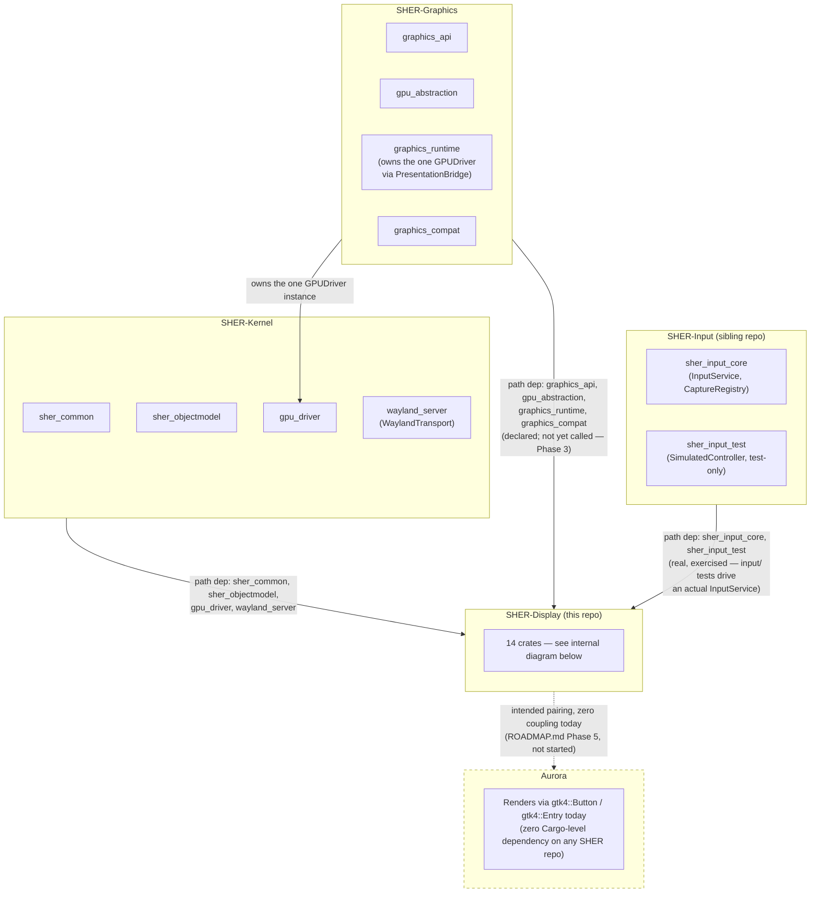
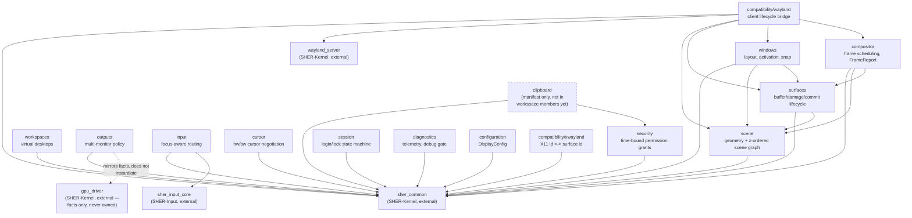
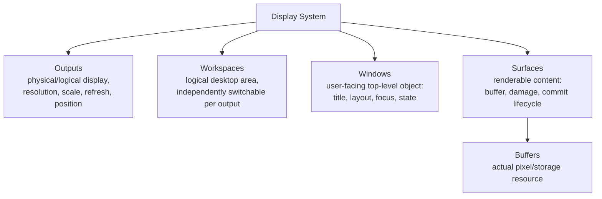

# SHER-Display architecture

This is a diagram-first supplement to [VISION.md](../../VISION.md) (product
vision, ownership boundaries, definition of done) and
[ROADMAP.md](../../ROADMAP.md) (phased status). Read those for the prose;
this doc exists because the cross-repo and cross-crate shape is easier to
follow as a picture. No claim here is new — everything below is drawn
directly from `Cargo.toml` dependency declarations (real, checked) and
`VISION.md`'s existing ownership table, not aspirational.

## Cross-repo layering (the SHER family)

**What the dashed arrow means:** `SHER-Display` → `Aurora` is drawn dashed
because it is a *documented intent*, not a build-time dependency. Verified
by reading Aurora's own `Cargo.toml`: zero references to any SHER-Display
(or any SHER) crate. This is a sequencing fact (Phase 5 hasn't started),
not evidence the pairing was dropped — see `README.md`'s "Known gaps"
section for the full reasoning.

**Load-bearing detail the diagram can't show on its own:** `SHER-Display`
depends on `SHER-Graphics`'s crates at the `Cargo.toml` level, but as of
this writing nothing in `SHER-Display`'s source actually calls into
`graphics_runtime` yet — Phase 3 ("SHER-Graphics Integration") is listed as
not started in `ROADMAP.md`. The dependency edge exists; the wiring behind
it does not.

## Ownership boundary (from VISION.md, restated as a table for reference)

| Subsystem | Owns | Must NOT own |
|---|---|---|
| SHER-Kernel | hardware, memory, scheduling, low-level IPC/transport, device primitives | desktop compositor policy |
| SHER-Graphics | GPU abstraction, rendering contexts, GPU sync, the one `GPUDriver` instance | window focus, desktop policy |
| SHER-Input | device lifecycle, canonical event stream, keyboard-layout mapping, capture enforcement | which application/window an event belongs to |
| **SHER-Display** | surfaces, windows, buffers, outputs, compositor, composition, frame scheduling, damage, focus, coordinate transforms, input-event *routing* | rendering execution, desktop visual policy |
| Aurora | panels, launcher, widgets, desktop policy, visual language | compositor/window-management mechanism |

The one architectural rule every crate in this repo is audited against
(most recently by `ROADMAP_HONEST.md`'s pass, zero violations found):
**never construct a driver or stateful hardware handle another subsystem
already owns.** `outputs/` mirrors `Connector`/`DisplayMode` *facts*; it
does not instantiate `gpu_driver::GPUDriver`. See VISION.md's "GPUDriver
ownership decision" for the one time this rule was violated and fixed.

## Internal crate layering (this repo, 14 crates)

Edges below are real `path`-dependency declarations read directly from each
crate's `Cargo.toml`, not an idealized target.

`clipboard` is dashed because it's a manifest-only stub — `clipboard/Cargo.toml`
exists, is not in `Cargo.toml`'s workspace `members` list, and does not
build or test as part of `cargo build --workspace`. See
[ROADMAP.md](../../ROADMAP.md) Phase 1.

## Display model (from VISION.md)

These five concepts are deliberately never collapsed into one struct — a
window can outlive the surface it wraps (XWayland re-parenting), and a
surface tree can exist with no window semantics at all (cursors, tooltips,
layer-shell-style overlays). See `VISION.md`'s "Display model" section for
the full rationale.

## What this doc does not cover

- Timing/sequence diagrams for a frame's lifecycle (damage → schedule →
  `FrameReport` → GPU submission) — not written yet, because the GPU
  submission half (Phase 3) doesn't exist yet to diagram accurately. Adding
  one now would show a path that isn't real.
- The target `crates/` layout from `ROADMAP.md` Phase 0 — that's an open
  decision, not the current structure, so it isn't diagrammed here as if it
  were live.
